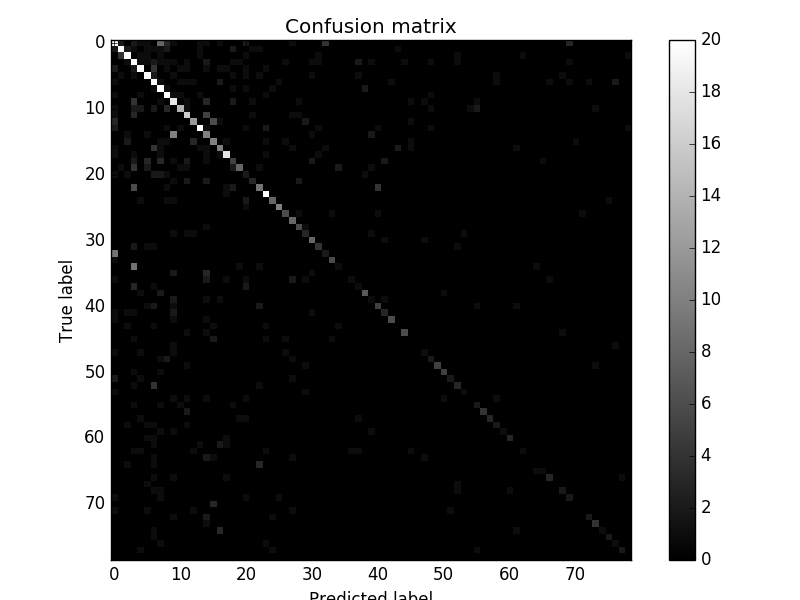

# 使用说明
这里面的代码可以用来预测一个句子所属的类别，其结构类似下图：

代码可以应用于中文文本，以单字的模式，或者分词的模式。在这里我们以jiayuan里缘缘助手的问题数据来说明接下来的使用方法。
我们的目标是把用户输入的每个问题都对应到某类标准问题上。
此数据集在处理后，包括79个类，其中训练集里包括5487个句子，测试集包括1371个句子。大的类有几百个样本点，小的类只有20个。

输入数据的格式如下，每行以tab间隔，第一列是所属类别，可以不连续，程序里会处理成连续的类别值（`[0, #类别数)`）；
第二列是未分词的句子，第三列是分词后的句子。

<pre>
154 VIP会员不能看信吗   VIP会员^不能^看信^吗
101 VIP会员如何设置择偶条件 VIP会员^如何^设置^择偶条件
108 vip vip
11  上面女会员照片  上面^女^会员^照片
83  不想它自动续费要怎么怎么操作    不想^它^自动^续费^要^怎么^怎么^操作
</pre>

在`jiayuan/train.py`中，有一些参数可以设置：

<pre>
class_threshold = 20  # 测试中只考虑样本数大于此值的类，样本量太小的类目不考虑；主要是应对此数据集里很长尾的类目问题
char_threshold = 3  # 对于在整个数据集里出现次数少于此值的元素，全部替换为公共的元素'UNK'
use_ori = False  # False：使用分词后的句子，每步表示一个词；True：使用未分词的原始句子，每步表示一个汉字
arg.seq_length = 20  # 为了优化计算效率以及解决Tensorflow里不能构建太多的计算图，我们会把所有句子裁剪或者填补成相同长度。
                     # 此值就表示此相同长度。填补时会在句子后面重复填补元素'PAD'
</pre>

# 测试结果
在测试集上最好的结果对应的各参数取值如下，预测准确率在`63%`左右（不同的训练集测试集分割会有些波动）：

<pre>
model=gru, lr=0.001, rnn_size=128, seq_length=20, num_layers=1, use_ori=False
</pre>

在此数据集上gru显著优于lstm和rnn，可能是因为数据少的原因。更多可见[此说明](results.md)。

测试集上预测结果的混淆矩阵如下图（对超过20的数量截断为20，以免图像可以清晰体现较小的值）：

