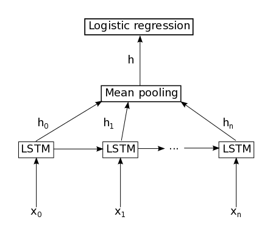
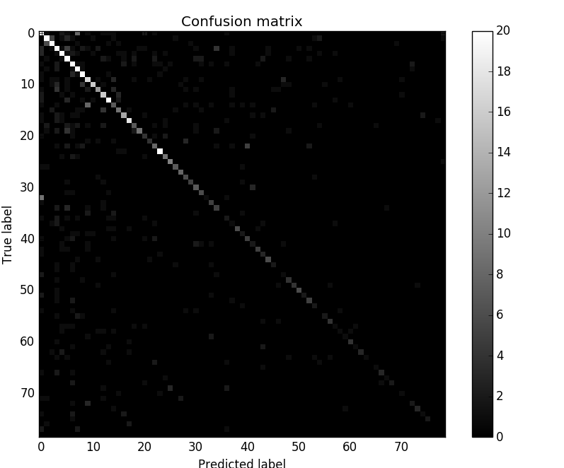

# 本文件夹内容
这里面的代码可以用来预测一个句子所属的类别，其结构类似下图：

代码可以应用于中文文本，以单字的模式，或者分词的模式。在这里我们以jiayuan里缘缘助手的问题数据来说明接下来的使用方法。
输入数据的格式如下，每行以tab间隔，第一列是所属类别，可以不连续，程序里会处理成连续的类别值（`[0, #类别数)`）；第二列是未分词的句子，第三列是分词后的句子。：

<pre>
154 VIP会员不能看信吗   VIP会员^不能^看信^吗
101 VIP会员如何设置择偶条件 VIP会员^如何^设置^择偶条件
108 vip vip
11  上面女会员照片  上面^女^会员^照片
83  不想它自动续费要怎么怎么操作    不想^它^自动^续费^要^怎么^怎么^操作
</pre>

在`jiayuan/train.py`中，有一些参数可以设置
# 测试结果
见[此文件](results.md)。

结果的混淆矩阵如下图（对超过20的数量截断为20，以免图像可以清晰体现较小的值）：

